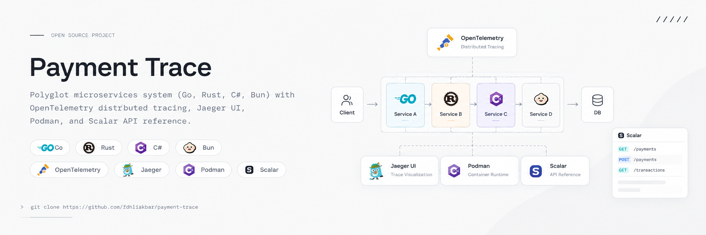
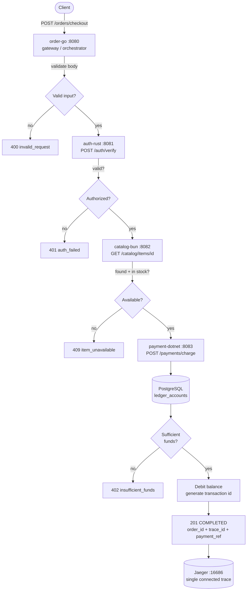
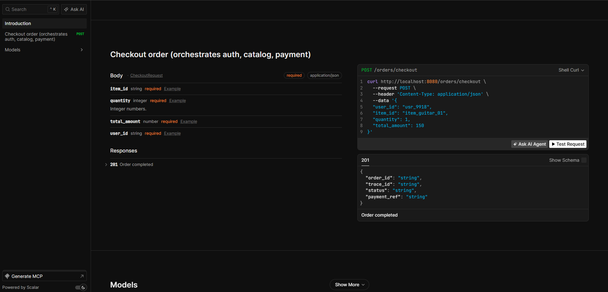
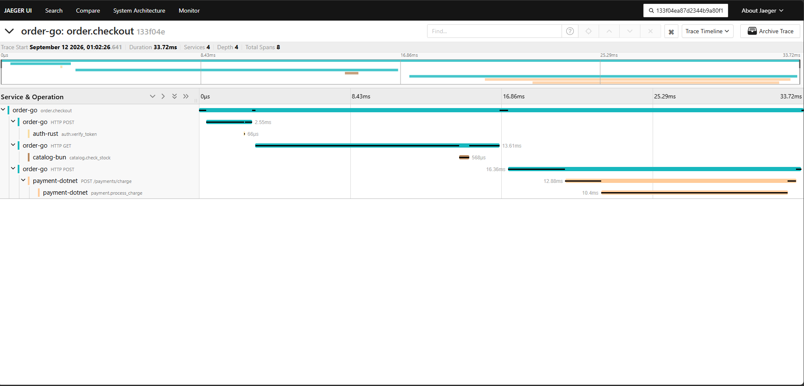
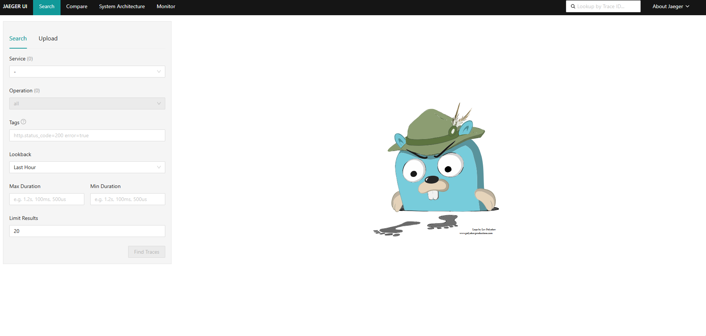

# Payment Trace

A polyglot distributed payment microservices architecture built with **Go**, **Rust**, **C#**, and **Bun**, containerized with **Podman**, featuring end-to-end distributed tracing via **OpenTelemetry** and **Jaeger**, structured JSON logging, **PostgreSQL** persistence, and interactive OpenAPI docs powered by **Scalar**.

<div align="center">
    
</div>

---

## Table of Contents

- [Architecture Overview](#architecture-overview)
- [Program Logic](#program-logic)
- [Flowchart](#flowchart)
- [Technology](#technology)
- [Ports](#ports)
- [Prerequisites](#prerequisites)
- [How to Run (Start to Finish)](#how-to-run-start-to-finish)
- [Verify the System Works](#verify-the-system-works)
- [Output Example](#output-example)
- [Direct Service Calls](#direct-service-calls)
- [Inspect Traces in Jaeger](#inspect-traces-in-jaeger)
- [How to Stop Everything](#how-to-stop-everything)
- [Troubleshooting](#troubleshooting)
- [Support Me](#support-me)

---

## Architecture Overview

The system has one public entrypoint (`order-go`) that orchestrates three independent downstream services. Every service emits traces to a shared Jaeger instance, and the trace context is propagated across service boundaries using the W3C `traceparent` header, so a single checkout produces one connected trace.

| Service | Language | Role | Internal Dependencies |
|---|---|---|---|
| **order-go** | Go | Public gateway / orchestrator, Scalar docs | auth-rust, catalog-bun, payment-dotnet, Postgres |
| **auth-rust** | Rust | Token and user verification | None (leaf) |
| **catalog-bun** | Bun / TypeScript | Product catalog and stock check | None (leaf) |
| **payment-dotnet** | C# / .NET | Charge processing and ledger write | PostgreSQL |
| **jaeger** | - | Trace collector and UI | - |
| **postgres** | - | Ledger and order persistence | - |

Only `order-go` is meant to be called by clients. The other three are internal services on the shared `payment-mesh` network.

---

## Program Logic

### 1. order-go (Go) - Orchestrator

File: `services/order-go/main.go`

1. On startup, initializes an OpenTelemetry tracer provider that exports to Jaeger over OTLP gRPC, and registers a W3C trace context propagator.
2. Exposes `GET /health`, `GET /docs` (Scalar UI), `GET /openapi.json`, and `POST /orders/checkout`.
3. On `POST /orders/checkout` it starts a root span named `order.checkout`:
   - Parses and validates the JSON body (`user_id`, `item_id`, `quantity`). Returns `400` on invalid input.
   - Calls **auth-rust** `POST /auth/verify`. On failure returns `401 auth_failed`.
   - Calls **catalog-bun** `GET /catalog/items/{item_id}`. If the item is missing or out of stock, returns `409 item_unavailable`.
   - Calls **payment-dotnet** `POST /payments/charge`. On failure returns `402 payment_failed`.
   - Generates an `order_id`, logs a structured JSON line, and returns `201` with `order_id`, `trace_id`, `status`, and `payment_ref`.
4. Every outgoing call injects the current trace context into the request headers, so downstream spans attach to the same trace.
5. Logs are emitted as structured JSON containing `trace_id` and `span_id`.

### 2. auth-rust (Rust) - Token Verification

File: `services/auth-rust/src/main.rs`

1. On startup, installs an OTLP tracer exporter and a JSON `tracing` subscriber.
2. Exposes `POST /auth/verify` and `GET /health`.
3. On verify, it extracts the incoming `traceparent` header to continue the parent trace, then starts a child span `auth.verify_token`.
4. A token is considered valid when it is non-empty and not the literal `invalid`. Returns `{ "valid": true, "user_id": "..." }`. Note: this is demo logic, not real authentication.

### 3. catalog-bun (Bun / TypeScript) - Product Catalog

File: `services/catalog-bun/index.ts`

1. On startup, registers a NodeSDK tracer exporter (OTLP HTTP) and a W3C propagator. Handles `SIGTERM` by flushing traces before exit.
2. Serves an in-memory catalog of items and exposes `GET /catalog/items/:id`, `GET /catalog/debug/headers`, and `GET /health`.
3. On lookup, it extracts the parent trace context from the request headers, starts a child span `catalog.check_stock`, and returns the item. Missing items return `404 item_not_found`.
4. Out-of-stock items are returned normally with `in_stock: false`; the orchestrator decides to reject them.

### 4. payment-dotnet (C# / .NET) - Payment and Ledger

File: `services/payment-dotnet/Program.cs`

1. On startup, configures OpenTelemetry with ASP.NET Core and HttpClient instrumentation, exporting to Jaeger over OTLP gRPC.
2. Exposes `POST /payments/charge` and `GET /health`.
3. On charge, inside a `payment.process_charge` activity it:
   - Opens a PostgreSQL connection.
   - Ensures a ledger account exists for the user (`INSERT ... ON CONFLICT DO NOTHING`, seeded with a `1000` balance).
   - Locks and reads the balance with `SELECT ... FOR UPDATE`.
   - If the balance is less than the amount, returns `402 insufficient_funds`.
   - Otherwise deducts the amount, returns `{ "transaction_id": "tx_csharp_xxxxx", "status": "APPROVED" }`, and logs the result.

### 5. Data Layer (PostgreSQL)

File: `infra/init-db.sql`

Applied automatically the first time the Postgres container boots. Creates:

- `ledger_accounts` - account id, user id, balance with a `CHECK (balance >= 0)` constraint, currency, timestamps.
- `orders` - order id, user, item, quantity, total amount, status, payment reference, trace id.
- Indexes on `user_id`, `trace_id`, and `status`.
- A seeded demo account `usr_9918` with a `1000.00` balance.

Note: the current `order-go` implementation generates the `order_id` and returns it in the response without writing to the `orders` table. The table exists in the schema for future persistence work.

---

## Flowchart



Trace cascade in one trace:

```text
order.go  order.checkout
  -> auth-rust        auth.verify_token
  -> catalog-bun      catalog.check_stock
  -> payment-dotnet   payment.process_charge
```

---

## Technology

| Tech | Desc |
|---|---|
|Podman|container runtime and orchestration|
|Go (chi,zap)|public gateway and orchestration|
|Rust (axum,tracing,opentelemtry)|auth service|
|Bun (Hono, OTel Node SDK)|catalog service|
|C# (.NET)|payment and ledger service|
|PostgreSQL V16|persistence for ledger accounts and orders|
|Open Telemetry + Jaeger|distributed tracing across all services.|
|Scalar|open API documentation|
|W3C trace context|`traceparent` propagation across service boundaries|

## Ports

| Service | Port | URL |
|---|---|---|
| **order-go** (gateway) | **8080** | http://localhost:8080 |
| auth-rust | 8081 | http://localhost:8081 |
| catalog-bun (products) | 8082 | http://localhost:8082 |
| payment-dotnet | 8083 | http://localhost:8083 |
| Jaeger UI | 16686 | http://localhost:16686 |
| PostgreSQL | 5432 | `localhost:5432` |
| OTLP (gRPC / HTTP) | 4317 / 4318 | internal |

---

## Prerequisites

- Windows with **WSL2** (Ubuntu) installed, or a Linux environment.
- **Podman** and **podman-compose** inside WSL.
- `git` and `curl` inside WSL.

Check that the tooling exists:

```bash
wsl
podman --version
podman-compose --version
```

---

## How to Run (Start to Finish)

### Step 1 - Open WSL and get the code

```bash
wsl
git clone <your-repo-url> /payment-trace
cd /payment-trace
```

### Step 2 - Confirm you are in the project root

You should see `podman-compose.yml`, `services/`, and `infra/`:

```bash
ls
```

### Step 3 - Build and start the whole stack

This builds all four services and starts Jaeger, Postgres, and the services. The `--build` flag is important on the first run and after any code change.

```bash
podman-compose -f podman-compose.yml up -d --build
```

### Step 4 - Check that containers are running

```bash
podman-compose -f podman-compose.yml ps
```

All services should report `Up` or `running`. Postgres should report `healthy` after a few seconds.

### Step 5 - Wait for startup, then verify health

Give the services 10-20 seconds on the first boot (image builds and DB init take time), then run the checks in the next section.

### Step 6 - Create an order

```bash
curl -X POST http://localhost:8080/orders/checkout \
  -H "Content-Type: application/json" \
  -d '{"user_id":"usr_9918","item_id":"item_guitar_01","quantity":1,"total_amount":150.00}'
```

### Step 7 - Inspect the trace

Open http://localhost:16686 in your Windows browser, then search by the `trace_id` from the response or by service `order-go`.

### Step 8 - Stop everything

```bash
podman-compose -f podman-compose.yml down
```

See [How to Stop Everything](#how-to-stop-everything) for a full teardown including the database volume.

### Running Infra Only

If you only want Jaeger and Postgres (for example, while running services locally with `go run`), start just those two:

```bash
podman-compose -f podman-compose.yml up -d jaeger postgres
podman-compose -f podman-compose.yml ps
curl -s -o /dev/null -w "Jaeger UI %{http_code}\n" http://localhost:16686
podman exec postgres pg_isready -U devuser -d payment_db
```

Tail logs from everything:

```bash
podman-compose -f podman-compose.yml logs -f
# or a single container:
podman logs -f order-go
```

---

## Verify the System Works

Run these in order. Each one confirms a different layer.

```bash
# 1. Container status
podman-compose -f podman-compose.yml ps

# 2. Gateway health
curl http://localhost:8080/health

# 3. Each downstream service health
curl http://localhost:8081/health
curl http://localhost:8082/health
curl http://localhost:8083/health

# 4. Database is accepting connections
podman exec postgres pg_isready -U devuser -d payment_db

# 5. Jaeger UI is up
curl -s -o /dev/null -w "Jaeger UI %{http_code}\n" http://localhost:16686

# 6. Scalar API docs
curl -s -o /dev/null -w "Scalar docs %{http_code}\n" http://localhost:8080/docs
```

---

## Output Example

### Order with Go Service

```text
POST http://localhost:8080/orders/checkout
```

Request body:

```json
{
  "user_id": "usr_9918",
  "item_id": "item_guitar_01",
  "quantity": 1,
  "total_amount": 150.00
}
```

Response:

```json
{
  "order_id": "ord_149746",
  "trace_id": "133f04ea87d2344b9a80f1e91503e561",
  "status": "COMPLETED",
  "payment_ref": "tx_csharp_17444"
}
```

### API Documentation with Scalar

<div align="center">
    
</div>

### Trace with Jaeger

<div align="center">
    
</div>

<div align="center">
    
</div>

---

## Direct Service Calls

Useful for testing individual services without going through the gateway.

```bash
# Auth: verify a token
curl -X POST http://localhost:8081/auth/verify \
  -H "Content-Type: application/json" \
  -d '{"user_id":"usr_9918","token":"demo-token"}'

# Catalog: look up an item
curl http://localhost:8082/catalog/items/item_guitar_01

# Payment: charge a user
curl -X POST http://localhost:8083/payments/charge \
  -H "Content-Type: application/json" \
  -d '{"user_id":"usr_9918","amount":150.00}'

# Scalar OpenAPI UI
curl http://localhost:8080/docs
```

Available catalog items:

| Item ID | Name | Price | In Stock |
|---|---|---|---|
| `item_guitar_01` | Solid Wood Tele | 150.00 | yes |
| `item_amp_01` | Tube Amp 40W | 299.00 | yes |
| `item_pick_01` | Pack of Picks | 9.50 | no |

---

## Inspect Traces in Jaeger

1. Open http://localhost:16686 in your Windows browser.
2. Select the **order-go** service in the Service dropdown and click **Find Traces**.
3. Open the most recent trace. You should see the full cascade under a single `trace_id`:

```text
order-go        order.checkout
  -> auth-rust      auth.verify_token
  -> catalog-bun    catalog.check_stock
  -> payment-dotnet payment.process_charge
```

You can also paste the `trace_id` from a checkout response into the "Search by Trace ID" box to jump straight to that trace.

---

## How to Stop Everything

### Normal stop (keeps containers and the database volume)

Stops the containers but leaves them in place, so a later `up -d` is fast and your data survives.

```bash
podman-compose -f podman-compose.yml stop
```

### Full teardown (removes containers and network, keeps the DB volume)

Use this when you are finished for the day.

```bash
podman-compose -f podman-compose.yml down
```

Expected output looks like:

```text
podman-compose version: 1.0.6
['podman', '--version', '']
using podman version: 4.9.3
podman stop -t 10 order-go
order-go
exit code: 0
podman stop -t 10 payment-dotnet
payment-dotnet
exit code: 0
podman stop -t 10 catalog-bun
catalog-bun
exit code: 0
podman stop -t 10 auth-rust
WARN[0010] StopSignal SIGTERM failed to stop container auth-rust in 10 seconds, resorting to SIGKILL
auth-rust
exit code: 0
podman stop -t 10 postgres
postgres
exit code: 0
podman stop -t 10 jaeger
jaeger
exit code: 0
podman rm order-go
order-go
exit code: 0
podman rm payment-dotnet
payment-dotnet
exit code: 0
podman rm catalog-bun
catalog-bun
exit code: 0
podman rm auth-rust
auth-rust
exit code: 0
podman rm postgres
postgres
exit code: 0
podman rm jaeger
jaeger
exit code: 0
```

The `SIGTERM failed ... resorting to SIGKILL` warning on `auth-rust` is expected and harmless. Podman waits 10 seconds, then force-kills the still-draining Rust process.

### Hard reset (wipes the database volume)

This deletes all data and re-runs the schema seed on the next start. Use it when you want a clean database.

```bash
podman-compose -f podman-compose.yml down -v
podman-compose -f podman-compose.yml up -d --build
```

### Confirm nothing is left running

```bash
podman ps -a
podman-compose -f podman-compose.yml ps
```

### Remove leftover containers or images (optional)

```bash
# Force-remove any remaining payment-trace containers by name
podman rm -f jaeger postgres auth-rust catalog-bun payment-dotnet order-go

# Remove the built images for this project
podman rmi $(podman images --filter reference='*payment*' -q)
```

---

## Troubleshooting

| Symptom | Cause | Fix |
|---|---|---|
| Port already in use (8080-8083, 5432, 16686) | Another service or a previous run holds the port | Stop the old stack with `down`, then check `podman ps -a` for leftovers |
| `order-go` cannot reach downstream services | Services not started or still building | Check `podman-compose ps` and `podman logs -f order-go` |
| Payment returns `402 insufficient_funds` | Ledger balance is below the charge amount | The demo account seeds with `1000.00`; use a total at or below that, or reset the DB with `down -v` |
| Checkout returns `409 item_unavailable` | Item not in catalog or out of stock | Use `item_guitar_01` or `item_amp_01`; `item_pick_01` is intentionally out of stock |
| No traces in Jaeger | Sampling or export endpoint mismatch | Confirm Jaeger is up on 16686, then check `podman logs -f order-go` for export errors |
| `auth-rust` SIGKILL warning on stop | Rust process does not exit within the 10s grace period | Expected, no action needed |
| `localhost` from Windows does not connect | Podman publishes ports inside WSL | Run `curl` inside the same WSL distro, and open the UI from Windows at `localhost` |
| Database schema missing | Volume predates schema changes | Run `down -v` then `up -d --build` to re-run `infra/init-db.sql` |
